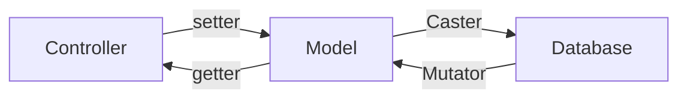

# ORM and Models

The aim is to make accessing database easier and more friendly using objects.

to create a new model:

```typescript
import { BaseModel, Attribute } from "@devbro/pashmak/orm";

export class User extends BaseModel {
  protected guarded: string[] = ["password"];

  @Attribute({ primaryKey: true, incrementingPrimaryKey: true })
  declare id: number;

  @Attribute()
  declare username: string;

  @Attribute({
    default: true,
  })
  declare active: boolean;

  @Attribute()
  declare password: string;
}
```

every attribute that comes from database must get a @Attribute() decorator. It will tell the model what needs to be loaded or saved to database.

## Primary Key

every model will need a unique identified that you mark using `primaryKey:true`. If the value of your primary key is auto-calculated in the database during insert, then `incrementingPrimaryKey: true` will let model know to get the newly generated id after create.

## Default Value

If you need to set default value for an attribute, you will need to do so through @Attribute decorator. If you assign default value directly, then expect unexpected behavior where default value overrides actual value during model constructor.

```ts
@Attribute({
  default: "hello",
})
declare var1: string;

@Attribute()
public var2: string = "bad"; // ❌ if you do this, then new Model({var2: "new_val" }) will not work
```

## guarded

if you want to mark a attribute as sensetive, you can use guarded to tell the model to not include it when we call toJson();

## toJson()

you can convert a model object to a json using `toJson()` to send or save clean data.

## save()

to save your data to database, if it is an object that was retrieved from database, then it will update database.

## delete()

to delete the model from database. data still reside in the object.

## Model.create()

to Quickly create a new object that is saved to database

```ts
let comment = await Comment.create<Comment>({
  author: "Tiger Cat",
  comment: "story of my life",
});
```

## table name

table name is auto calculated as plural of the model name. so Country model will look rows from countries table.

if you want to override the table name:

```
protected tableName: string = 'mars_countries';
```

## creating a new model

```
let user = new User();
user.fill({ username: 'meowadmin' });
// or
let user = new User({ username: 'meowadmin' });
```

only parameters marked with @attribute will be filled.

## Generally Available methods

### refresh()

sometimes you need to reload data from database. you can do this by

```ts
console.log(user.username); // meow
user.username = "newusername";
console.log(user.username); // newusername
await user.refresh();
console.log(user.username); // meow
```

### find() / findByPrimaryKey()

assuming you are using `id` as your primary key, you can find objects by id

```ts
await User.find(123);
await User.findByPrimaryKey(123);
```

if find fails, it will return undefined

### findOrFail()

same as `find()` but will throw an error on failure

### findOne()

it will return the first object that matches the search matches you provide.

```ts
await USer.findOne({ username: "meowadmin" });
```

note: the search parameters need to be exact match. they also can be anything defined in database but not in your model.

### getQuery()

returns a query object with table predefined

```ts
await User.getQuery();
```

### fill()

to mass field parameters in a object

```ts
user.fill({ email: "meow@devbro.com" });
```

### isDirty()

The `isDirty()` method checks if the model or specific attribute(s) have been modified since the last save. This is useful for tracking changes before persisting them to the database.

**Usage:**

```ts
// Check if any attribute has been modified
if (user.isDirty()) {
  console.log("User has unsaved changes");
}

// Check if a specific attribute has been modified
if (user.isDirty("username")) {
  console.log("Username has been changed");
}

// Check if any of multiple attributes have been modified
if (user.isDirty(["email", "username"])) {
  console.log("Either email or username has been changed");
}
```

**Parameters:**

- `attribute` (optional): Can be:
  - `undefined` - checks if any attribute is dirty
  - `string` - checks if a specific attribute is dirty
  - `string[]` - checks if any of the specified attributes are dirty

**Returns:**

- `boolean` - `true` if the specified attribute(s) have been modified, `false` otherwise

**Example:**

```ts
let user = await User.find(123);
console.log(user.isDirty()); // false - no changes yet

user.username = "newusername";
console.log(user.isDirty()); // true - has unsaved changes
console.log(user.isDirty("username")); // true - username was changed
console.log(user.isDirty("email")); // false - email was not changed

await user.save();
console.log(user.isDirty()); // false - changes have been saved
```

### `created_at` and `updated_at` timestamps

every model comes with standard `created_at` and `updated_at` fields. you can use these fields to track when they were created and updated last.

to modify standard behaviors you can define your models as such:

```ts
class Animal extends BaseModel {
  protected hasTimestamps = true;
  protected timestampFormat = "yyyy-MM-dd HH:mm:ss.SSS";
  protected createdAtFieldName = "created_at";
  protected updatedAtFieldName = "updated_at";

  @Attribute()
  declare created_at: Date;

  @attribute()
  declare updated_at: Date;
}
```

- hasTimestamps: controls if class has time stamp fields or not. you can set to false if your model does not have these fields.
- timestampFormat: the format timestamp needs to be converted to in string before inserting to database.
- createdAtFieldName: the field name that will contain created_at date
- updatedAtFeildName: the field name that contains updated_at date

these values are calculated automatically during save(). if save() is successfull created_at and updated_at will be adjust in the model.

if you want to run save() without update timestamps then:

```ts
await cat.save({ updateTimestamps: false });
```

## Casters and Mutators

casters can be used to modify the field when we read it from database.
mutators can be used to modify the data when we write it to database.



you can define casters and mutators for an attributes

```ts
@attributes({
  caster: (val: Date) => val.toISOString(),
  mutator: (val: string) => parseStringToDate(val),
})
declare date_of_birth: Date;
```

## Scopes

Scopes is the concept of adding extra limitations to queries used within ORM.

There are two types of scopes you can use Global vs Local.

### Global Scopes

Global scopes are autoloaded by the model on every query request.

```ts
class Region2 extends GlobalScope {
  public async apply(query: Query): Promise<Query> {
    let region_id = ctx().get<User>("authenticated_user").region_id;
    return query.whereOp("region_id", "=", region_id);
  }
}

class HasIinName extends GlobalScope {
  public async apply(query: Query): Promise<Query> {
    return query.whereOp("country_name", "ILIKE", "%I%");
  }
}

class Country2 extends BaseModel {
  protected tableName: string = "countries";
  protected hasTimestamps: boolean = false;
  scopes = [Region2, HasIinName];

  @Attribute({ primaryKey: true, incrementingPrimaryKey: false })
  public country_id: number | undefined;

  @Attribute()
  public country_name: string | undefined;

  @Attribute()
  public region_id: number | undefined;

  regions(): Region[] {
    return [];
  }
}

let countries = await (await Country2.getQuery()).get();
```

One advantage of GlobalScope is you can use one for multiple models.
Main use case for globalScope is use with Authorization logic where you can limit
access to records before they are loaded from database.

### Local Scope

There may be situations that you want easier to read queries OR your query logics are too complicated to rewrite in multiple places.

For this purpose, you can override `static getQuery` of a model class to return an extended `Query` object. This way you can add more methods for your local scopes.

this class added a few extra localscope functions that can help with casting.

```ts
class Country extends BaseModel {
  public static getQuery() {
    let rc = new Query();

    rc.region = function (region_id) {
      this.whereOp("region_id", "=", region_id);
      return this;
    };

    return rc;
  }
}

let c1_obj = await (await Country.getQuery()).region(1).getObject(); // return an object of type Country or undefined

let c1_objs = await (await Country.getQuery()).region(1).getObjects(); // return an array of type Country, or array will be empty if none match
```
