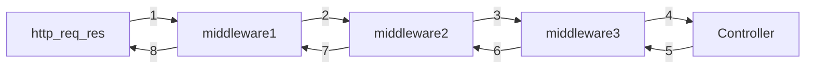

# Controller and Middlewares

Pashmak can accept both function and class controllers.

## Functional Controllers

Functional controllers are simple async functions that receive request and response objects:

```ts
import { Request, Response } from "@devbro/pashmak/router";
import { router } from "@devbro/pashmak/facades";

router().addRoute(
  ["GET"],
  "/api/v1/hello",
  async (req: Request, res: Response) => {
    return { message: "Hello World" };
  },
);
```

## Class Controllers

Class controllers provide a cleaner way to organize your routes using decorators:

```ts
import { db, storage, logger } from "@devbro/pashmak/facades";
import { ctx } from "@devbro/pashmak/context";
import {
  Request,
  Response,
  Model,
  Param,
  BaseController,
  Controller,
  Get,
  Post,
  Put,
  Delete,
} from "@devbro/pashmak/router";

@Controller("/api/v1/cats", {
  middlewares: [mid1, mid2],
})
export class CatController extends BaseController {
  @Get("/", { middlewares: [logResponseMiddleware] })
  async list() {
    const r = await db().runQuery({
      sql: "select * from cats",
      parts: [],
      bindings: [],
    });
    return {
      message: "GET cats",
      data: r,
    };
  }

  @Post("/")
  async store() {
    const req = ctx().get<Request>("request");
    logger().info({ msg: "request details", body: req.body, files: req.files });

    return { success: true };
  }

  @Get("/:id")
  async show(@Param("id") id: string) {
    return { id, name: "cat name" };
  }

  @Put("/:id")
  async update(
    @Param("id") id: string,
    @Model(CatModel, "id", "id") cat: CatModel,
  ) {
    // Model decorator automatically fetches the cat by id
    cat.name = "Updated name";
    await cat.save();
    return cat;
  }

  @Delete("/:id")
  async delete(@Param("id") id: string) {
    await CatModel.deleteById(id);
    return { success: true };
  }

  @Get("/file")
  async getFile() {
    const res = ctx().get<Response>("response");
    await res.writeHead(200, {
      "Content-Type": "image/jpeg",
    });

    (await storage().getStream("test.jpg")).pipe(res);
  }

  @Get("/file-details")
  async getFileDetails() {
    return await storage().metadata("test.jpg");
  }

  @Get("/:id/notes/:noteId")
  showNotes(@Param("noteId") noteId: string, @Param("id") id: string) {
    return { id, noteId, notes: [] };
  }
}
```

## Controller Decorators

### HTTP Method Decorators

- `@Get("path", options?)` - Handle GET and HEAD requests
- `@Post("path", options?)` - Handle POST requests
- `@Put("path", options?)` - Handle PUT requests
- `@Delete("path", options?)` - Handle DELETE requests
- `@Patch("path", options?)` - Handle PATCH requests

Each decorator accepts an optional configuration object:

```ts
@Get("/path", {
  middlewares: [middleware1, middleware2]  // Route-specific middlewares
})
```

### Parameter Decorators

#### @Param(param_name)

Extracts a specific parameter from the request URL and injects it into the controller method:

```ts
@Get("/:id")
async show(@Param("id") id: string) {
  // id contains the value from the URL parameter
  return { id };
}
```

#### @Model(ModelClass, param_name?, model_field?)

Automatically fetches a model instance based on a route parameter and injects it into the controller method:

- `ModelClass` - The ORM model class to fetch
- `param_name` - Optional, defaults to "id". The parameter name in the URL.
- `model_field` - Optional, defaults to "id". The field in the model to match against the param value.

```ts
@Put("/:userId")
async update(@Param("userId") userId: string, @Model(User,'userId','id') user: User) {
  // user is automatically fetched from database
  user.name = "Updated name";
  await user.save();
  return user;
}
```

#### @ValidatedRequest(validation_schema)

This decorator is defined under `src/helpers/validation.ts` to allow modification/replacement of main validation library. Currently there is support for both Yup and Zod validation libraries.

```ts
import * as yup from "yup";
import zod from "zod";

const createUserSchema = yup.object({
  name: yup.string().required(),
  email: yup.string().email().required(),
});

const updateUserSchema = zod.object({
  name: zod.string().optional(),
  email: zod.string().email().optional(),
});

@Post()
async create(@ValidatedRequest(createUserSchema) data: any) {
  // data is validated and type-safe
  return await User.create(data);
}

@Put("/:id")
async update(@Param("id") id: string, @ValidatedRequest(updateUserSchema) data: any) {
  return { "message": "User updated", data};
}
```

## Registering Controllers

To use a controller, it must be registered with the router:

```ts
import { router } from "@devbro/pashmak/facades";
import { CatController } from "./app/controllers/CatController";

router().addController(CatController);
```

## Middlewares

Middlewares are functions or classes that can execute with direct access to the request and response objects.
The main distinction between middlewares in Pashmak vs nestjs or express or fastify is that middlewares can execute before or after the controller method.



### Middleware Execution Order

Middlewares are executed in the following order:

1. Global middlewares defined in router
2. Middlewares defined at controller class level
3. Middlewares defined at individual method/function level

If you used parentRouter.addRouter(childRouter), then middlewares of parentRouter are executed then middlewares of childRouter.

```ts
import { router } from "@devbro/pashmak/facades";

// 1. Global middleware (runs first)
router().addGlobalMiddleware(authMiddleware);

// 2. Controller-level middleware (runs second)
@Controller("/api/v1/users", {
  middlewares: [checkPermissions],
})
export class UserController extends BaseController {
  // 3. Method-level middleware (runs last)
  @Get({ middlewares: [logRequest] })
  async list() {
    return [];
  }
}
```

## Direct Response Manipulation

For more complex responses, you can directly modify the Response object:

```ts
import { Request, Response } from "@devbro/pashmak/router";

async (req: Request, res: Response) => {
  res.writeHead(200, { "Content-Type": "application/json" });
  res.write(JSON.stringify({ message: "Custom response" }));
};
```

If do so, make sure to call `res.writeHead()` to set the status code and headers before writing the response body.
When writing response directly, it is highly recommended to use `res.write()` instead of `res.end()` to allow middlewares and error handling to function properly.

## Decorators

Currently decorators are supported only on classes and class-methods.

#### making your own decorators

to simplify making your own decorators you can use `createParamDecorator` helper from `@devbro/pashmak/router`

```ts
import * as yup from "yup";
import { z } from "zod";
import { ctx } from "@devbro/pashmak/context";
import { Request, createParamDecorator } from "@devbro/pashmak/router";

export function ValidatedRequest(
  validationRules:
    | yup.ObjectSchema<any>
    | (() => yup.ObjectSchema<any>)
    | z.ZodType<any>
    | (() => z.ZodType<any>),
): ParameterDecorator {
  return createParamDecorator(async () => {
    const schema =
      typeof validationRules === "function"
        ? validationRules()
        : validationRules;
    const requestBody = ctx().get<Request>("request").body;

    // Check if it's a Zod schema by checking for parse method
    if ("parse" in schema && typeof schema.parse === "function") {
      return await schema.parseAsync(requestBody);
    }

    // Otherwise, treat it as Yup schema
    const rc = await (schema as yup.ObjectSchema<any>)
      .noUnknown()
      .validate(requestBody, { abortEarly: false });

    return rc;
  });
}
```
